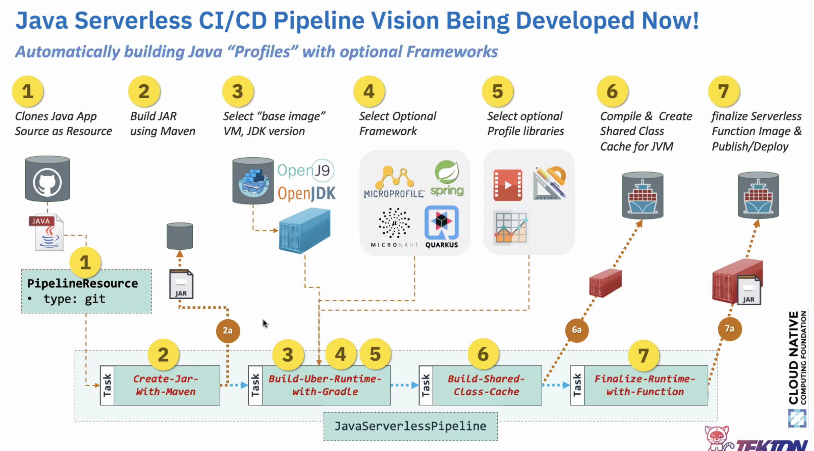

## Building OpenWhisk Application with Tekton for Knative

## Java

In a recent experiment with OpenWhisk, we built a Tekton pipeline to create an image with OpenWhisk Java Runtime serving an application source from GitHub repo.

Here is the list of `Tasks` created:

* [01-create-jar-with-maven.yaml](tasks/java/01-create-jar-with-maven.yaml) - Pull Java Application with an OpenWhisk action
from an open GitHub repo, with java action taking an image and converting it into gray image. Compile the source code
and build Jar file using Maven if POM file exists at the root of application repo.

* [02-build-runtime-with-gradle.yaml](tasks/java/02-build-runtime-with-gradle.yaml) - Select the JDK version, optional framework,
and optional profile libraries.

* [03-build-shared-class-cache.yaml](tasks/java/03-build-shared-class-cache.yaml) - Compile OpenWhisk Java runtime i.e.
create Java Shared Class Cache for proxy.

* [04-finalize-runtime-with-function.yaml](tasks/java/04-finalize-runtime-with-function.yaml) - Inject Java application
Jar into the OpenWhisk runtime and build/publish an image.

* Use Knative Serving to deploy the finalized image on Knative.




This entire pipeline is designed in [pipeline-to-build-openwhisk-app.yaml](pipeline/pipeline-to-build-openwhisk-app.yaml) including all the `Tasks` defined above and
pipeline run in [pipelinerun-java-yaml.tmpl](pipelinerun/java/pipelinerun-java.yaml.tmpl) to execute the pipeline.  

Deploy `Tasks` and `Pipeline` using [deploy.sh](deploy.sh):

[deploy.sh](deploy.sh) need two environment variables `DOCKER_USERNAME` and `DOCKER_PASSWORD` set to appropriate Docker credentials in plain text.

```shell script
./deploy.sh
secret/dockerhub-user-pass created
serviceaccount/openwhisk-app-builder created
condition.tekton.dev/is-nodejs-runtime created
condition.tekton.dev/is-java-runtime created
condition.tekton.dev/is-python-runtime created
task.tekton.dev/task-install-npm-packages created
task.tekton.dev/task-build-archive created
task.tekton.dev/openwhisk created
task.tekton.dev/create-jar-with-maven created
task.tekton.dev/build-runtime-with-gradle created
task.tekton.dev/build-shared-class-cache created
task.tekton.dev/finalize-runtime-with-function created
pipeline.tekton.dev/build-openwhisk-app created
```

Execute `PipelineRun` with:

```shell script
sed -e 's/${DOCKER_USERNAME}/'"$DOCKER_USERNAME"'/' pipelinerun/java/pipelinerun-java.yaml.tmpl > pipelinerun/java/pipelinerun-java.yaml
kubectl apply -f pipelinerun/java/pipelinerun-java.yaml
```

Listing all the `Tasks`, `Pipeline`, and `PipelineRun`:

```shell script
kubectl get all
NAME                                                                  READY   STATUS      RESTARTS   AGE
pod/build-java-app-image-build-runtime-with-gradle-5s7pt-pod-x6btf    0/5     Completed   0          4m1s
pod/build-java-app-image-build-shared-class-cache-7w9q6-pod-5dw4n     0/6     Completed   0          3m27s
pod/build-java-app-image-create-jar-with-maven-9l6hh-is-java--mcrlw   0/2     Completed   0          5m37s
pod/build-java-app-image-create-jar-with-maven-9l6hh-pod-t6c2x        0/9     Completed   0          5m22s
pod/build-java-app-image-finalize-runtime-with-function-59qfw-fxhgt   0/10    Completed   0          2m53s
pod/build-java-app-image-install-npm-packages-xzgvz-is-nodejs-tkmzn   0/2     Error       0          5m37s

NAME                 TYPE        CLUSTER-IP   EXTERNAL-IP   PORT(S)   AGE
service/kubernetes   ClusterIP   10.96.0.1    <none>        443/TCP   96d

NAME                                                                                 SUCCEEDED   REASON      STARTTIME   COMPLETIONTIME
taskrun.tekton.dev/build-java-app-image-build-runtime-with-gradle-5s7pt              True        Succeeded   4m1s        3m27s
taskrun.tekton.dev/build-java-app-image-build-shared-class-cache-7w9q6               True        Succeeded   3m27s       2m53s
taskrun.tekton.dev/build-java-app-image-create-jar-with-maven-9l6hh                  True        Succeeded   5m22s       4m1s
taskrun.tekton.dev/build-java-app-image-create-jar-with-maven-9l6hh-is-java--gxqfx   True        Succeeded   5m37s       5m22s
taskrun.tekton.dev/build-java-app-image-finalize-runtime-with-function-59qfw         True        Succeeded   2m53s       92s
taskrun.tekton.dev/build-java-app-image-install-npm-packages-xzgvz-is-nodejs-6g7hb   False       Failed      5m37s       5m22s

NAME                                     AGE
condition.tekton.dev/is-java-runtime     16m
condition.tekton.dev/is-nodejs-runtime   16m
condition.tekton.dev/is-python-runtime   16m

NAME                                          SUCCEEDED   REASON      STARTTIME   COMPLETIONTIME
pipelinerun.tekton.dev/build-java-app-image   True        Succeeded   5m37s       92s

NAME                                             AGE
task.tekton.dev/build-runtime-with-gradle        16m
task.tekton.dev/build-shared-class-cache         16m
task.tekton.dev/create-jar-with-maven            16m
task.tekton.dev/finalize-runtime-with-function   16m
task.tekton.dev/openwhisk                        16m
task.tekton.dev/task-build-archive               16m
task.tekton.dev/task-install-npm-packages        16m

NAME                                      AGE
pipeline.tekton.dev/build-openwhisk-app   16m
```

Create a new service on Knative with:

```shell script
sed -e 's/${DOCKER_USERNAME}/'"$DOCKER_USERNAME"'/' service/service-openwhisk-java-app.yaml.tmpl > service/service-openwhisk-java-app.yaml
kubectl apply -f service/service-openwhisk-java-app.yaml
```

Run OpenWhisk Java Application service with few different images:

```shell script
curl -H "Host: openwhisk-java-app.default.example.com" -d '@01-dice-color.json' -H "Content-Type: application/json" -X POST http://localhost:32319/run | jq -r '.body' | base64 -D > 01-dice-gray.png
```

 => 

```shell script
curl -H "Host: openwhisk-java-app.default.example.com" -d '@02-conf-crowd.json' -H "Content-Type: application/json" -X POST http://localhost:32319/run | jq -r '.body' | base64 -D > 02-conf-crowd-gray.png
```

 => 

```shell script
curl -H "Host: openwhisk-java-app.default.example.com" -d '{"value": {"png": "'$(base64 images/03-eclipsecon-2019.png | tr -d \\n)'"}}' -H "Content-Type: application/json" -X POST http://localhost:32319/run | jq -r '.body' | base64 -D > 03-eclipsecon-2019-gray.png
```

 => 


## NodeJS/Javascript

Here is the list of `Tasks` created:

* [01-install-deps.yaml](tasks/javascript/01-install-deps.yaml) - Pull NodeJS Application source with an OpenWhisk action
from an open GitHub repo and download a list of dependencies specified in the `package.json` file.

* [02-build-archive.yaml](tasks/javascript/02-build-archive.yaml) - Build an archive with application source and all the dependencies.

* [03-openwhisk.yaml](tasks/javascript/03-openwhisk.yaml) - Inject NodeJS application archive built in previous task into the
OpenWhisk runtime and build/publish an image.

* Use Knative Serving to deploy the finalized image on Knative.

This entire pipeline is designed in [pipeline-to-build-openwhisk-app.yaml](pipeline/pipeline-to-build-openwhisk-app.yaml) including all the `Tasks` defined above and
pipeline run in [pipelinerun-build-padding-app.yaml.tmpl](pipelinerun/javascript/pipelinerun-build-padding-app.yaml.tmpl) to execute the pipeline.  

Deploy `Tasks` and `Pipeline` using [deploy.sh](deploy.sh) if not already done:

[deploy.sh](deploy.sh) need two environment variables `DOCKER_USERNAME` and `DOCKER_PASSWORD` set to appropriate Docker credentials in plain text.

```shell script
./deploy.sh
secret/dockerhub-user-pass created
serviceaccount/openwhisk-app-builder created
condition.tekton.dev/is-nodejs-runtime created
condition.tekton.dev/is-java-runtime created
condition.tekton.dev/is-python-runtime created
task.tekton.dev/task-install-npm-packages created
task.tekton.dev/task-build-archive created
task.tekton.dev/openwhisk created
task.tekton.dev/create-jar-with-maven created
task.tekton.dev/build-runtime-with-gradle created
task.tekton.dev/build-shared-class-cache created
task.tekton.dev/finalize-runtime-with-function created
pipeline.tekton.dev/build-openwhisk-app created
```

Execute `PipelineRun` with:

```shell script
sed -e 's/${DOCKER_USERNAME}/'"$DOCKER_USERNAME"'/' pipelinerun/javascript/pipelinerun-build-padding-app.yaml.tmpl > pipelinerun/javascript/pipelinerun-build-padding-app.yaml
kubectl apply -f pipelinerun/javascript/pipelinerun-build-padding-app.yaml
```

Listing all the `Tasks`, `Pipeline`, and `PipelineRun`:

```shell script
kubectl get all
NAME                                                                  READY   STATUS      RESTARTS   AGE
pod/build-app-image-build-archive-76bqc-pod-nd9h6                     0/6     Completed   0          6m13s
pod/build-app-image-build-openwhisk-app-image-n8g66-pod-zqdwm         0/8     Completed   0          5m47s
pod/build-app-image-create-jar-with-maven-z2tfj-is-java-runti-bzrbk   0/2     Error       0          6m39s
pod/build-app-image-install-npm-packages-f2vq7-is-nodejs-runt-4h9ck   0/2     Completed   0          6m39s
pod/build-app-image-install-npm-packages-f2vq7-pod-8xzpr              0/5     Completed   0          6m30s

NAME                 TYPE        CLUSTER-IP   EXTERNAL-IP   PORT(S)   AGE
service/kubernetes   ClusterIP   10.96.0.1    <none>        443/TCP   96d

NAME                                             AGE
task.tekton.dev/build-runtime-with-gradle        29m
task.tekton.dev/build-shared-class-cache         29m
task.tekton.dev/create-jar-with-maven            29m
task.tekton.dev/finalize-runtime-with-function   29m
task.tekton.dev/openwhisk                        29m
task.tekton.dev/task-build-archive               29m
task.tekton.dev/task-install-npm-packages        29m

NAME                                      AGE
pipeline.tekton.dev/build-openwhisk-app   29m

NAME                                                                                 SUCCEEDED   REASON      STARTTIME   COMPLETIONTIME
taskrun.tekton.dev/build-app-image-build-archive-76bqc                               True        Succeeded   6m13s       5m47s
taskrun.tekton.dev/build-app-image-build-openwhisk-app-image-n8g66                   True        Succeeded   5m47s       2m31s
taskrun.tekton.dev/build-app-image-create-jar-with-maven-z2tfj-is-java-runti-b5jlh   False       Failed      6m39s       6m27s
taskrun.tekton.dev/build-app-image-install-npm-packages-f2vq7                        True        Succeeded   6m31s       6m13s
taskrun.tekton.dev/build-app-image-install-npm-packages-f2vq7-is-nodejs-runt-z8wc9   True        Succeeded   6m39s       6m31s

NAME                                     AGE
condition.tekton.dev/is-java-runtime     30m
condition.tekton.dev/is-nodejs-runtime   30m
condition.tekton.dev/is-python-runtime   30m

NAME                                     SUCCEEDED   REASON      STARTTIME   COMPLETIONTIME
pipelinerun.tekton.dev/build-app-image   True        Succeeded   6m39s       2m31s
```

Create a new service on Knative with:

```shell script
sed -e 's/${DOCKER_USERNAME}/'"$DOCKER_USERNAME"'/' service/service-openwhisk-javascript-app.yaml.tmpl > service/service-openwhisk-javascript-app.yaml
kubectl apply -f service/service-openwhisk-javascript-app.yaml
```

Run OpenWhisk NodeJS Application service:

```shell script
curl -H "Host: openwhisk-javascript-app.default.example.com" -d '@left-padding-data-run.json' -H "Content-Type: application/json" -X POST http://localhost:32319/
{"padded":[".........................Hello","..................How are you?"]}
```
